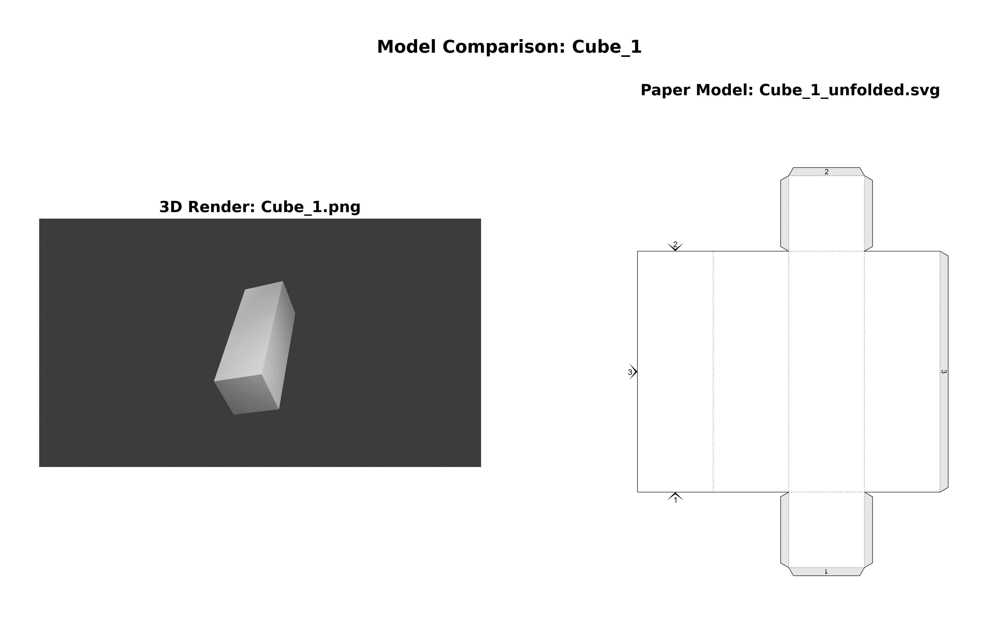
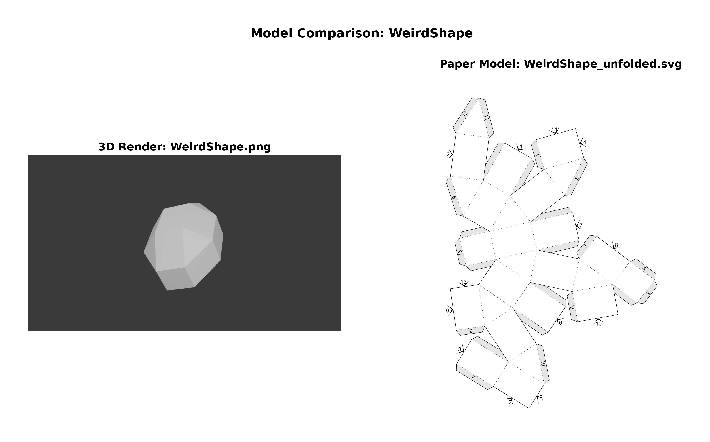

# 3D to 2D Paper Model Converter

A Python tool to convert 3D models from Blender into unfolded paper models for printing and assembly.

<p align="center">
  
  
</p>

## Features

- **3D to Paper Model Conversion**: Convert OBJ files to unfolded SVG paper models
- **High-Quality Rendering**: Generate PNG renders of 3D models with configurable settings
- **Visualization Tools**: Create side-by-side comparisons of 3D renders and paper models
- **Batch Processing**: Process multiple models efficiently
- **Flexible Output Formats**: Support for SVG and PDF paper model formats

## Installation

### Prerequisites

- **Python 3.11** 
- **Windows 10/11**

### Setup

1. **Create a virtual environment**
   ```bash
   python -m venv venv
   ```

2. **Activate the virtual environment**
   ```bash
   # Windows
   venv\Scripts\activate.bat
   ```

3. **Install dependencies**
   ```bash
   pip install -r requirements.txt
   ```

## How to Run

### 1. Convert OBJ to Paper Model (`inference.py`)

Convert a 3D model to an unfolded paper model:

```bash
# Single file conversion
python inference.py --input model.obj --output model_unfolded.svg

# Batch process all OBJ files in a folder
python inference.py --input-dir models --output-dir output
```

**Options:**
- `--input`: Input OBJ file path (single file mode)
- `--output`: Output SVG/PDF file path (single file mode)
- `--input-dir`: Directory containing OBJ files for batch processing
- `--output-dir`: Directory to save unfolded models (default: output)
- `--format`: Output format (svg or pdf, default: svg)
- `--verbose`: Enable verbose logging

**Examples:**
```bash
# Single file conversion
python inference.py --input models/cube.obj --output output/cube_unfolded.svg --format svg

# Batch process all OBJ files in models folder
python inference.py --input-dir models --output-dir output --format pdf

# Batch process with verbose logging
python inference.py --input-dir models --verbose
```

**Batch Processing:**
- Processes all `.obj` files in the specified input directory
- Automatically generates output files with `_unfolded` suffix
- Creates output directory if it doesn't exist
- Example: `models/cube.obj` → `output/cube_unfolded.svg`

### 2. Generate 3D Renders (`obj2png.py`)

Create PNG renders of 3D models with automatic camera framing:

```bash
# Single file processing
python obj2png.py model.obj model.png

# Batch processing
python obj2png.py --input-dir models --output-dir output
```

**Options:**
- `--input-dir`: Directory containing OBJ files for batch processing
- `--output-dir`: Directory to save rendered PNG files (batch processing)
- `--engine`: Rendering engine (cycles or eevee, default: cycles)
- `--resolution`: Output resolution (HD, FHD, 4K, 8K, default: FHD)
- `--quality`: Render quality (fast, medium, high, default: medium)
- `--verbose`: Enable verbose logging

**Rendering Engines:**
- **cycles**: Photorealistic rendering with ray tracing (slower, higher quality)
- **eevee**: Real-time rendering engine (faster, good quality for most use cases)

**Examples:**
```bash
# Single file with custom settings
python obj2png.py models/cube.obj output/cube.png --resolution 4K --engine cycles

# Batch process all OBJ files in models folder
python obj2png.py --input-dir models --output-dir output --resolution FHD

# Batch process with EEVEE engine for faster rendering
python obj2png.py --input-dir models --output-dir output --engine eevee --quality fast

# High quality batch processing
python obj2png.py --input-dir models --output-dir output --engine cycles --resolution 4K --quality high
```

**Features:**
- **Automatic Camera Framing**: Camera automatically positions to frame the entire object
- **Flexible Resolution**: Support for HD (1280x720) to 8K (7680x4320) resolutions
- **Multiple Engines**: Choose between Cycles (photorealistic) and EEVEE (fast)
- **Batch Processing**: Process all OBJ files in a directory automatically
- **Professional Lighting**: Automatic 3-point lighting setup
- **Error Handling**: Continues processing other files if one fails

**Batch Processing:**
- Processes all `.obj` files in the specified input directory
- Automatically generates output files with same base name and `.png` extension
- Creates output directory if it doesn't exist
- Example: `models/cube.obj` → `renders/cube.png`

### 3. Create Visual Comparisons (`visualize_models.py`)

Generate side-by-side comparisons of 3D renders and paper models:

```bash
python visualize_models.py
```

**File Pairing Logic:**
The script automatically pairs files in the same directory where:
- **3D Render**: `model.png` (or .jpg/.jpeg)
- **Paper Model**: `model_unfolded.pdf`, `model_unfolded.svg`, or `model_unfolded.png` (or .jpg/.jpeg)

**Options:**
- `--input-dir`: Directory containing both 3D render files and paper model files (default: output)
- `--output-dir`: Directory for comparison images (default: comparisons)
- `--dpi`: Resolution for conversions (default: 300)
- `--no-summary`: Skip creating summary PDF
- `--render-files`: Specific render files to process
- `--paper-files`: Specific paper model files to process
- `--verbose`: Enable verbose logging

**Examples:**
```bash
# Process all files with default settings
python visualize_models.py

# Custom input directory
python visualize_models.py --input-dir output --output-dir plots 

# High resolution output
python visualize_models.py --dpi 600

# Process specific files
python visualize_models.py --render-files model1.png model2.png --paper-files model1_unfolded.pdf model2_unfolded.svg
```

## File Structure

```
Export-Paper-Model-from-Blender/
├── inference.py              # Main conversion script
├── obj2png.py               # 3D render generation
├── visualize_models.py      # Comparison visualization
├── io_export_paper_model.py # Blender addon (core functionality)
├── requirements.txt         # Python dependencies
├── README.md               # This file
├── models/                 # Input 3D models (OBJ files)
├── output/                 # Generated files
│   ├── model.png          # 3D render
│   └── model_unfolded.svg # Paper model
└── plots/           # Side-by-side comparisons
    ├── model_comparison.png
    └── all_comparisons.pdf
```

## Workflow Example

### Single Model Workflow

1. **Prepare your 3D model** (e.g., `models/cube.obj`)

2. **Generate 3D render:**
   ```bash
   python obj2png.py --input models/cube.obj --output output/cube.png
   ```

3. **Convert to paper model:**
   ```bash
   python inference.py --input models/cube.obj --output output/cube_unfolded.svg
   ```

4. **Create comparison:**
   ```bash
   python visualize_models.py
   ```

5. **Results:**
   - `output/cube.png` - 3D render
   - `output/cube_unfolded.svg` - Paper model
   - `comparisons/cube_comparison.png` - Side-by-side comparison
   - `comparisons/all_comparisons.pdf` - Summary PDF

### Batch Processing Workflow

1. **Prepare multiple 3D models** in a folder (e.g., `models/`)

2. **Batch convert all models to paper models:**
   ```bash
   python inference.py --input-dir models --output-dir output --format svg
   ```

3. **Generate renders for all models:**
   ```bash
   python obj2png.py --input-dir models --output-dir output --resolution FHD
   ```

4. **Create comparisons for all models:**
   ```bash
   python visualize_models.py --input-dir output
   ```

5. **Results:**
   - All OBJ files converted to unfolded paper models
   - All models rendered as PNG images
   - Side-by-side comparisons for all model pairs
   - Summary PDF with all comparisons

## Troubleshooting

### Common Issues

**"Not freed memory blocks" message:**
- This is a debug message from Blender, not an error
- The script continues to work normally
- Can be safely ignored

**Import errors:**
- Ensure you're using Python 3.11+
- Activate the virtual environment before running scripts
- Reinstall dependencies: `pip install -r requirements.txt`

**Blender compatibility:**
- Tested with Blender 4.4.0
- Uses `bpy` library instead of full Blender installation
- No need to install Blender separately

**File pairing issues:**
- Ensure render files and paper models are in the same directory
- Follow the naming convention:
  - Render: `model.png`
  - Paper model: `model_unfolded.svg`, `model_unfolded.pdf`, or `model_unfolded.png`
- Check file extensions are supported (.png, .jpg, .jpeg for renders; .pdf, .svg, .png, .jpg, .jpeg for paper models)

**Batch processing issues:**
- Ensure input directory contains `.obj` files
- Check that output directory is writable
- Use `--verbose` flag for detailed error messages

### Performance Tips

- Use appropriate resolution settings for your needs
- Process files in batches for efficiency
- Monitor memory usage with large models
- For large batches, consider processing in smaller groups

## Dependencies

- **bpy==4.4.0**: Blender Python API
- **numpy**: Numerical operations
- **matplotlib**: Plotting and visualization
- **Pillow**: Image processing
- **PyMuPDF**: PDF processing
- **cairosvg**: SVG processing

## License

This project is open source. See the repository for license details.

## Contributing

Contributions are welcome! Please feel free to submit issues and pull requests.

## 📖 Citation

If you use this project in your research or publication, please cite it as follows:

```bibtex
@misc{banknatchapol2024paperconverter,
  title        = {3D to 2D Paper Model Converter},
  author       = {Natchapol Patamawisut},
  year         = {2025},
  howpublished = {\url{https://github.com/BankNatchapol/3D-to-2D-Paper-Model-Converter}},
  note         = {Python toolkit for converting 3D models from Blender into unfolded paper models and visualizations.}
}
```
